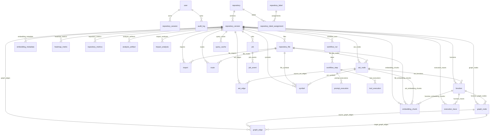

# 1 Database Overview

This PostgreSQL schema supports CodeAtlas’s immutable Repository Intelligence Model (RIM) and the full product lifecycle: repository import, versioned analysis, session persistence, workflow observability, graph persistence, embedding metadata, job tracking, audit logging, and future extensibility.

Key design principles:
- `RIM` is first-class and immutable.
- Every repository analysis creates a new `repository_version`.
- Graph storage is relational and hybrid, not in-memory only.
- Embeddings store metadata only; vectors remain in FAISS.
- Sessions are durable and replayable.
- Workflow observability captures intent through tool-level execution.
- Audit logs and job events support traceability.
- Extensible tables support labels, query cache, tool registry, and prompt templates.

---

# 2 ER Diagram (Mermaid)

---

# 3 Table Definitions

## `user`
- Purpose: authenticated user records.
- Columns:
  - `id`
  - `email`
  - `name`
  - `created_at`
  - `last_login_at`
  - `is_active`
- PK: `id`
- Unique: `email`

## `repository`
- Purpose: repository identity and import metadata.
- Columns:
  - `id`
  - `provider`
  - `owner`
  - `name`
  - `default_branch`
  - `remote_url`
  - `created_at`
  - `updated_at`
  - `is_active`
- PK: `id`
- Unique: (`provider`, `owner`, `name`)
- Indexes: `remote_url`

## `repository_label`
- Purpose: repository classification labels for search and discovery.
- Columns:
  - `id`
  - `name`
  - `description`
  - `created_at`
- PK: `id`
- Unique: `name`

## `repository_label_assignment`
- Purpose: assign labels to repositories.
- Columns:
  - `id`
  - `repository_id`
  - `label_id`
  - `assigned_at`
- PK: `id`
- Unique: (`repository_id`, `label_id`)
- FKs: `repository_id` -> `repository`, `label_id` -> `repository_label`

## `repository_version`
- Purpose: immutable RIM version per repository and commit.
- Columns:
  - `id`
  - `repository_id`
  - `commit_hash`
  - `branch`
  - `rim_version`
  - `parent_version_id`
  - `status`
  - `created_at`
  - `started_at`
  - `completed_at`
  - `error_message`
- PK: `id`
- FKs: `repository_id`, `parent_version_id` -> `repository_version`
- Unique: (`repository_id`, `rim_version`), (`repository_id`, `commit_hash`, `branch`)

## `repository_language`
- Purpose: canonical programming language metadata.
- Columns:
  - `id`
  - `name`
  - `family`
  - `created_at`
- PK: `id`
- Unique: `name`

## `repository_file`
- Purpose: file-level metadata tied to a RIM version.
- Columns:
  - `id`
  - `repository_version_id`
  - `path`
  - `language_id`
  - `file_hash`
  - `size_bytes`
  - `parsed_at`
  - `status`
- PK: `id`
- FKs: `repository_version_id`, `language_id`
- Unique: (`repository_version_id`, `path`)

## `function`
- Purpose: explicit function-level entities.
- Columns:
  - `id`
  - `repository_version_id`
  - `repository_file_id`
  - `ast_node_id`
  - `symbol_id`
  - `name`
  - `scope`
  - `line_start`
  - `line_end`
  - `cyclomatic_complexity`
  - `metadata`
- PK: `id`
- FKs: `repository_version_id`, `repository_file_id`, `ast_node_id`, `symbol_id`
- Indexes: (`repository_version_id`, `name`)

## `ast_node`
- Purpose: AST nodes for parsed code.
- Columns:
  - `id`
  - `repository_version_id`
  - `repository_file_id`
  - `node_type`
  - `start_line`
  - `end_line`
  - `start_column`
  - `end_column`
  - `value`
  - `normalized`
  - `parent_id`
  - `created_at`
- PK: `id`
- FKs: `repository_version_id`, `repository_file_id`, `parent_id` -> `ast_node`
- Indexes: `repository_version_id`, `repository_file_id`, `node_type`

## `ast_edge`
- Purpose: explicit AST parent-child relationships.
- Columns:
  - `id`
  - `repository_version_id`
  - `source_node_id`
  - `target_node_id`
  - `edge_type`
- PK: `id`
- FKs: `repository_version_id`, `source_node_id`, `target_node_id` -> `ast_node`
- Unique: (`repository_version_id`, `source_node_id`, `target_node_id`, `edge_type`)

## `symbol`
- Purpose: code symbols extracted from AST/files.
- Columns:
  - `id`
  - `repository_version_id`
  - `repository_file_id`
  - `ast_node_id`
  - `name`
  - `kind`
  - `scope`
  - `line_start`
  - `line_end`
  - `metadata`
- PK: `id`
- FKs: `repository_version_id`, `repository_file_id`, `ast_node_id`
- Indexes: (`repository_version_id`, `name`, `kind`)

## `import`
- Purpose: import/include statements and dependencies.
- Columns:
  - `id`
  - `repository_version_id`
  - `repository_file_id`
  - `imported_from`
  - `imported_to`
  - `line_number`
  - `metadata`
- PK: `id`
- FKs: `repository_version_id`, `repository_file_id`
- Indexes: (`repository_version_id`, `imported_from`, `imported_to`)

## `route`
- Purpose: routing definitions and handler metadata.
- Columns:
  - `id`
  - `repository_version_id`
  - `repository_file_id`
  - `route_path`
  - `http_method`
  - `handler_symbol_id`
  - `line_start`
  - `line_end`
  - `metadata`
- PK: `id`
- FKs: `repository_version_id`, `repository_file_id`, `handler_symbol_id`
- Indexes: (`repository_version_id`, `route_path`, `http_method`)

## `graph_node`
- Purpose: unified graph node across all graph types.
- Columns:
  - `id`
  - `repository_version_id`
  - `entity_type`
  - `entity_id`
  - `name`
  - `node_type`
  - `metadata`
- PK: `id`
- FKs: `repository_version_id`
- Unique: (`repository_version_id`, `entity_type`, `entity_id`)
- Indexes: (`repository_version_id`, `node_type`, `name`)
- Notes: `entity_type` distinguishes `FUNCTION`, `CLASS`, `MODULE`, `FILE`, `ROUTE`, `PACKAGE`, etc.; `entity_id` references the domain entity.

## `graph_edge`
- Purpose: unified graph edge with typed relationship.
- Columns:
  - `id`
  - `repository_version_id`
  - `graph_type`
  - `source_node_id`
  - `target_node_id`
  - `edge_type`
  - `metadata`
- PK: `id`
- FKs: `repository_version_id`, `source_node_id`, `target_node_id` -> `graph_node`
- Unique: (`repository_version_id`, `graph_type`, `source_node_id`, `target_node_id`, `edge_type`)
- Indexes: (`repository_version_id`, `graph_type`, `source_node_id`, `target_node_id`)

## `repository_metrics`
- Purpose: persisted repository-level statistics.
- Columns:
  - `id`
  - `repository_version_id`
  - `files_count`
  - `functions_count`
  - `classes_count`
  - `imports_count`
  - `cyclomatic_complexity`
  - `average_file_size`
  - `largest_module`
  - `dead_code_estimate`
  - `generated_at`
  - `metadata`
- PK: `id`
- FKs: `repository_version_id`
- Indexes: `repository_version_id`

## `repository_metrics_artifact`
- Purpose: optional derived metrics or historical metric artifacts.
- Columns:
  - `id`
  - `repository_version_id`
  - `metric_name`
  - `metric_value`
  - `metadata`
  - `created_at`
- PK: `id`
- Unique: (`repository_version_id`, `metric_name`)

## `heatmap_metric`
- Purpose: file/function heatmap and risk scoring.
- Columns:
  - `id`
  - `repository_version_id`
  - `repository_file_id`
  - `symbol_id`
  - `metric_name`
  - `metric_value`
  - `metadata`
- PK: `id`
- FKs: `repository_version_id`, `repository_file_id`, `symbol_id`
- Indexes: (`repository_version_id`, `metric_name`)

## `analysis_artifact`
- Purpose: generic derived artifacts (graphs, summaries, exports).
- Columns:
  - `id`
  - `repository_version_id`
  - `artifact_type`
  - `artifact_key`
  - `content`
  - `created_at`
- PK: `id`
- FKs: `repository_version_id`
- Unique: (`repository_version_id`, `artifact_type`, `artifact_key`)
- Indexes: (`repository_version_id`, `artifact_type`)

## `execution_trace`
- Purpose: persisted execution trace results.
- Columns:
  - `id`
  - `repository_version_id`
  - `trace_name`
  - `entry_function_id`
  - `steps`
  - `metadata`
  - `created_at`
- PK: `id`
- FKs: `repository_version_id`, `entry_function_id` -> `function`
- Indexes: (`repository_version_id`, `trace_name`)

## `impact_analysis`
- Purpose: persisted impact analysis.
- Columns:
  - `id`
  - `repository_version_id`
  - `analysis_name`
  - `affected_nodes`
  - `metadata`
  - `created_at`
- PK: `id`
- FKs: `repository_version_id`
- Indexes: (`repository_version_id`, `analysis_name`)

## `embedding_chunk`
- Purpose: metadata for chunks used in FAISS embeddings.
- Columns:
  - `id`
  - `repository_version_id`
  - `repository_file_id`
  - `ast_node_id`
  - `function_id`
  - `chunk_type`
  - `source_text`
  - `source_start_line`
  - `source_end_line`
  - `source_metadata`
  - `created_at`
- PK: `id`
- FKs: `repository_version_id`, `repository_file_id`, `ast_node_id`, `function_id`
- Indexes: (`repository_version_id`, `chunk_type`)

## `embedding_metadata`
- Purpose: embed index metadata without storing vectors.
- Columns:
  - `id`
  - `repository_version_id`
  - `embedding_chunk_id`
  - `vector_id`
  - `dimension`
  - `model_name`
  - `created_at`
- PK: `id`
- FKs: `repository_version_id`, `embedding_chunk_id`
- Unique: `vector_id`
- Indexes: (`repository_version_id`, `model_name`)

## `query_cache`
- Purpose: cache structured query responses per RIM version.
- Columns:
  - `id`
  - `repository_version_id`
  - `query_text`
  - `query_parameters`
  - `response`
  - `response_type`
  - `created_at`
  - `expires_at`
  - `hit_count`
- PK: `id`
- FKs: `repository_version_id`
- Unique: (`repository_version_id`, `query_text`, `query_parameters_hash`)
- Indexes: (`expires_at`)

## `repository_session`
- Purpose: persist user repository UI and conversation state.
- Columns:
  - `id`
  - `user_id`
  - `repository_id`
  - `repository_version_id`
  - `name`
  - `pinned_files`
  - `graph_viewport`
  - `expanded_nodes`
  - `recent_queries`
  - `conversation_history`
  - `filters`
  - `selected_branch`
  - `selected_version`
  - `created_at`
  - `updated_at`
- PK: `id`
- FKs: `user_id`, `repository_id`, `repository_version_id`
- Indexes: (`user_id`, `repository_id`, `repository_version_id`)

## `tool_registry`
- Purpose: register available RIE tools and schemas.
- Columns:
  - `id`
  - `name`
  - `version`
  - `description`
  - `input_schema`
  - `output_schema`
  - `created_at`
  - `updated_at`
- PK: `id`
- Unique: (`name`, `version`)
- Indexes: `name`

## `workflow_run`
- Purpose: top-level workflow observability.
- Columns:
  - `id`
  - `repository_version_id`
  - `name`
  - `intent`
  - `status`
  - `started_at`
  - `completed_at`
  - `result`
  - `error_message`
- PK: `id`
- FKs: `repository_version_id`
- Indexes: (`repository_version_id`, `status`)

## `workflow_step`
- Purpose: step-level workflow execution details.
- Columns:
  - `id`
  - `workflow_run_id`
  - `step_name`
  - `step_type`
  - `status`
  - `started_at`
  - `completed_at`
  - `metadata`
- PK: `id`
- FKs: `workflow_run_id`
- Indexes: (`workflow_run_id`, `step_type`, `status`)

## `prompt_template`
- Purpose: reusable prompt templates.
- Columns:
  - `id`
  - `name`
  - `description`
  - `template_text`
  - `created_at`
  - `updated_at`
- PK: `id`
- Unique: `name`

## `prompt_template_variable`
- Purpose: template variable metadata.
- Columns:
  - `id`
  - `prompt_template_id`
  - `variable_name`
  - `description`
  - `required`
- PK: `id`
- FKs: `prompt_template_id`
- Unique: (`prompt_template_id`, `variable_name`)

## `prompt_execution`
- Purpose: record prompt execution using templates and variables.
- Columns:
  - `id`
  - `workflow_step_id`
  - `prompt_template_id`
  - `prompt_variables`
  - `rendered_prompt_hash`
  - `response_summary`
  - `response_metadata`
  - `tokens_used`
  - `latency_ms`
  - `created_at`
- PK: `id`
- FKs: `workflow_step_id`, `prompt_template_id`
- Indexes: (`workflow_step_id`, `prompt_template_id`)

## `tool_execution`
- Purpose: tool invocation tracking.
- Columns:
  - `id`
  - `workflow_step_id`
  - `tool_registry_id`
  - `input`
  - `output`
  - `status`
  - `latency_ms`
  - `error_message`
  - `created_at`
- PK: `id`
- FKs: `workflow_step_id`, `tool_registry_id`
- Indexes: (`workflow_step_id`, `tool_registry_id`, `status`)

## `job`
- Purpose: asynchronous job lifecycle tracking.
- Columns:
  - `id`
  - `repository_version_id`
  - `job_type`
  - `status`
  - `queued_at`
  - `started_at`
  - `completed_at`
  - `failed_at`
  - `worker_id`
  - `retry_count`
  - `max_retries`
  - `duration_ms`
  - `payload`
  - `error_message`
- PK: `id`
- FKs: `repository_version_id`
- Indexes: (`job_type`, `status`, `worker_id`)

## `job_event`
- Purpose: event log for job state transitions.
- Columns:
  - `id`
  - `job_id`
  - `event_type`
  - `event_time`
  - `details`
- PK: `id`
- FKs: `job_id`
- Indexes: (`job_id`, `event_type`)

## `audit_log`
- Purpose: domain-level audit history.
- Columns:
  - `id`
  - `actor_user_id`
  - `repository_id`
  - `repository_version_id`
  - `event_type`
  - `event_time`
  - `details`
- PK: `id`
- FKs: `actor_user_id`, `repository_id`, `repository_version_id`
- Indexes: (`event_type`, `event_time`)

## `user_preference`
- Purpose: user preferences storage.
- Columns:
  - `id`
  - `user_id`
  - `preference_key`
  - `preference_value`
  - `updated_at`
- PK: `id`
- FKs: `user_id`
- Unique: (`user_id`, `preference_key`)

---

# 4 Relationships

- `repository` 1:N `repository_version`
- `repository` 1:N `repository_label_assignment`
- `repository_version` 1:N `repository_file`, `function`, `ast_node`, `graph_node`, `graph_edge`, `embedding_chunk`, `embedding_metadata`, `heatmap_metric`, `repository_metrics`, `analysis_artifact`, `execution_trace`, `impact_analysis`, `workflow_run`, `job`, `query_cache`
- `repository_file` 1:N `ast_node`, `symbol`, `import`, `route`, `embedding_chunk`
- `ast_node` 1:N `ast_edge`, `symbol`, `function`, `embedding_chunk`
- `function` 1:N `execution_trace`, `embedding_chunk`
- `graph_node` 1:N `graph_edge` as source and target
- `workflow_run` 1:N `workflow_step`
- `workflow_step` 1:N `prompt_execution`, `tool_execution`
- `job` 1:N `job_event`
- `user` 1:N `repository_session`, `audit_log`, `user_preference`

Cascade rules:
- Delete `repository_version` cascades to all version-scoped RIM artifacts.
- Delete `repository_file` cascades to file-scoped AST/symbol/import/route/embedding records.
- Delete `workflow_run` cascades to steps/executions.
- Delete `job` cascades to job events.
- Delete `repository_label` restricts or requires label cleanup.

---

# 5 Index Strategy

Recommended indexes:
- `repository(provider, owner, name)` unique
- `repository(remote_url)`
- `repository_version(repository_id, rim_version)` unique
- `repository_version(repository_id, commit_hash)`
- `repository_file(repository_version_id, path)` unique
- `graph_node(repository_version_id, node_type)`
- `graph_edge(repository_version_id, graph_type, source_node_id, target_node_id)`
- `symbol(repository_version_id, name)`
- `function(repository_version_id, name)`
- `route(repository_version_id, route_path, http_method)`
- `embedding_chunk(repository_version_id, repository_file_id)`
- `embedding_metadata(vector_id)` unique
- `query_cache(repository_version_id, query_text, query_parameters_hash)`
- `workflow_run(repository_version_id, status)`
- `job(job_type, status)`
- `audit_log(event_type, event_time)`

Additional recommendations:
- `GIN` indexes on JSONB columns used for filtering (`metadata`, `prompt_variables`, `response_metadata`, `filters`, `conversation_history`)
- Partial indexes for active statuses, e.g. jobs queued/running, workflow steps in progress
- `BRIN` or partitioned indexes on large append-only tables like `audit_log` and `job_event`

---

# 6 Constraints

Key constraints:
- `repository_version.status` ENUM-like values: `NEW`, `QUEUED`, `CLONING`, `PARSING`, `GRAPH_BUILDING`, `EMBEDDING`, `BUILDING_RIM`, `READY`, `FAILED`
- `repository_version.rim_version > 0`
- `repository_file.size_bytes >= 0`
- `ast_node.start_line > 0` and `ast_node.end_line >= ast_node.start_line`
- `function.line_start > 0` and `function.line_end >= function.line_start`
- `embedding_metadata.dimension > 0`
- `job.retry_count >= 0`, `job.max_retries >= 0`
- `workflow_step.status` restricted to valid pipeline states
- `prompt_template_variable.variable_name` non-empty
- `query_cache.expires_at > created_at`

Use `CHECK` constraints where applicable and `NOT NULL` for required fields. Preserve referential integrity with cascading deletes on version-scoped content and restricted deletes for users/audit references.

---

# 7 Versioning Strategy

Versioning strategy:
- `repository_version` is the immutable RIM version record.
- `rim_version` increments per repository and represents analysis version.
- `commit_hash` identifies the code snapshot.
- `parent_version_id` records lineage for incremental updates and rollback.
- Graph versions and embedding versions are tied to `repository_version`; no separate version table is required unless future split is needed.
- New analysis always creates a new `repository_version`.
- Previous versions remain read-only and are used for history, comparison, and replay.
- `repository_session` stores `selected_version` and references `repository_version_id` for recovery.
- `repository_metrics` persist derived statistics per version.

---

# 8 Graph Storage Strategy

Graph persistence uses a hybrid relational model:
- `graph_node` stores all node types once per RIM version.
- `graph_edge` stores typed relationships across graph types.
- `graph_type` distinguishes `CALL`, `DEPENDENCY`, `IMPORT`, `ROUTE`, `INHERITANCE`, `CFG`, etc.
- `edge_type` provides finer semantics within each graph.
- `entity_type` and `entity_id` in `graph_node` connect nodes to explicit domain entities like `FUNCTION`, `CLASS`, `FILE`, `ROUTE`, `PACKAGE`.
- This avoids duplicate node tables and supports nodes participating in multiple graphs.
- AST connectivity continues to use `ast_node` + `ast_edge`.
- Graph metadata remains in JSONB for flexible annotations.
- Use relational edge tables for efficient traversal and querying.
- Persist graphs in PostgreSQL as source of truth; use NetworkX only transiently for in-memory computation.

---

# 9 Embedding Storage Strategy

Embedding metadata design:
- `embedding_chunk` stores chunk provenance:
  - file reference
  - AST reference
  - function reference
  - chunk type
  - source text
  - line range
  - metadata
- `embedding_metadata` stores:
  - external `vector_id`
  - vector dimension
  - model name
  - creation timestamp
- Vectors are stored in FAISS only.
- PostgreSQL avoids storing dense vectors.
- This ensures provenance and version alignment while keeping the database lightweight.

---

# 10 Session Strategy

`repository_session` supports persistent user workspace state:
- pinned files
- graph viewport
- expanded nodes
- recent queries
- conversation history
- filters
- selected branch
- selected version

Design notes:
- store session payloads as `jsonb` for flexibility
- use `repository_version_id` to recreate exact state
- enable immediate restoration and replay

---

# 11 Workflow Tracking

Workflow observability is supported through:
- `workflow_run` for high-level workflow intent and status
- `workflow_step` for step-level execution
- `prompt_template` and `prompt_template_variable` to avoid prompt duplication
- `prompt_execution` for template-based prompt execution and response metadata
- `tool_registry` for canonical tool definitions
- `tool_execution` for tool call input/output, timing, and errors

This allows:
- full provenance for RIE decisions
- tracing of workflow progress
- debugging of model prompts and tool calls
- metrics for latency and failures

---

# 12 Scaling Considerations

Performance recommendations:
- index versioned lookups by `repository_version_id`
- use `GIN` indexes for JSONB search fields
- apply partial indexes for active/interesting statuses
- monitor `graph_edge`, `ast_node`, and `embedding_chunk` growth carefully
- consider partitioning:
  - `audit_log` by `event_time`
  - `job_event` by `event_time`
  - `workflow_step` / `prompt_execution` by `workflow_run.created_at`
  - `repository_version` by `repository_id` if repository volume is extreme
- caching:
  - cache latest `repository_version` per repository
  - cache `repository_file` metadata and common graph node lookups
  - optionally cache session state in Redis for hot access
- archival:
  - archive old `audit_log`, `job_event`, `workflow_step`, `prompt_execution`, `tool_execution`
  - archive large `analysis_artifact` or historical metrics after retention

---

# 13 Future Extensions

This schema is extensible for:
- repository comparison tables
- additional graph analytics artifacts
- external graph DB references or hybrid persistence
- feature planner and change simulator artifacts
- API documentation tables
- richer repository labels and taxonomy
- granular response storage for RIE outputs
- separate graph version table if graph persistence needs decoupling from RIM versioning

The design supports growth without changing core versioning or RIM immutability.